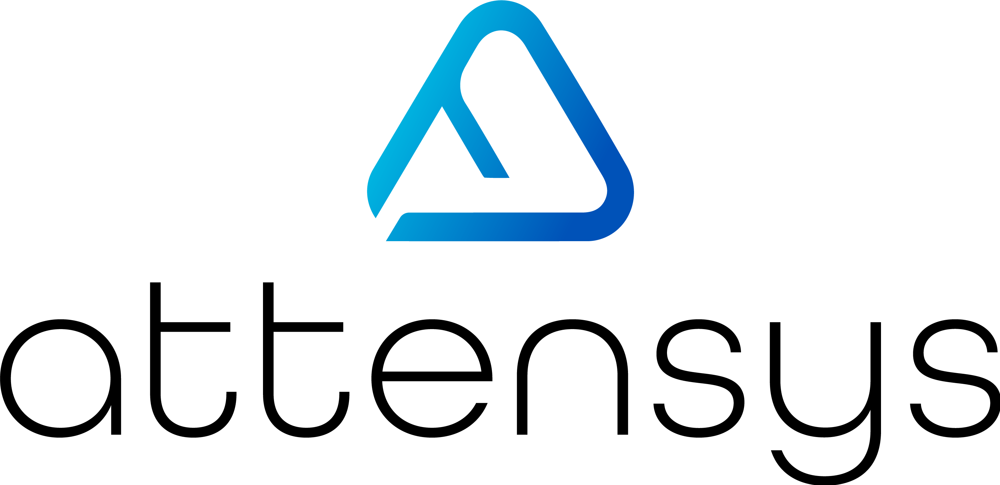

<div align="center">
<p align="center" style="width: 100%;">
    
    <br>
</p>
<h2>AttenSys - n8n Workflow Templates</h2>
<p align="center">
A collection of ready-to-import <b>n8n workflow templates</b> for automation
</p>
<p align="center">
<a href="https://github.com/attensys/n8n-workflows/blob/main/LICENSE"></a>
<a href="https://discord.gg/v3rTUufp"></a>
<a href="https://x.com/AttenSysAI"></a>
</p>
</div>

---

## 🔥 Overview

This repository contains **production-ready n8n workflow templates** that you can import and use immediately.

Each workflow includes:
- 📄 **JSON file** – Ready to import into n8n
- 📖 **Documentation** – Step-by-step setup guide
- 📸 **Screenshot** – Visual preview of the workflow

---

## 📄 Workflow Index

| **Workflow** | **Description** |
|--------------|-----------------|
| [AI Fashion Virtual Try-On](./workflows/ai-fashion-virtual-try-on/) | Virtual try-ons, AI fashion demos for Telegram, Discord & YouTube |
| [Auto Meeting Summarizer](./workflows/auto-meeting-summarizer/) | Summarize meeting recordings from Google Drive to Sheets |
| [Face Redaction](./workflows/face-redaction/) | Privacy-preservation by blurring faces in images |
| [UGC Marketing Videos](./workflows/ugc-marketing-videos/) | Generate UGC marketing videos for eCommerce |
| [Image to Ghibli Art](./workflows/image-to-ghibli-art/) | Convert images to Studio Ghibli style |
| [Video Generation (First/Last Frame)](./workflows/video-generation-first-last-frame/) | Generate smooth transition videos between two frames |
| [WordPress Post with AI](./workflows/wordpress-post-with-ai/) | Generate complete WordPress posts from keywords |

---

## 🚀 Quick Start

### 1. Install n8n

```bash
# Using npm
npm install n8n -g

# Or using Docker
docker run -it --rm --name n8n -p 5678:5678 n8nio/n8n
```

For detailed installation instructions, see the [n8n documentation](https://docs.n8n.io/installation/).

### 2. Import a Workflow

1. Open n8n at `http://localhost:5678`
2. Go to **Workflows → Import**
3. Upload `workflow.json` from any workflow folder
4. Configure the required credentials (see each workflow's README)

---

## 📦 Repository Structure

```
n8n-workflows/
├── workflows/
│   ├── ai-fashion-virtual-try-on/
│   │   ├── workflow.json
│   │   ├── README.md
│   │   └── screenshot.png
│   ├── auto-meeting-summarizer/
│   ├── face-redaction/
│   ├── ugc-marketing-videos/
│   ├── image-to-ghibli-art/
│   ├── video-generation-first-last-frame/
│   └── wordpress-post-with-ai/
└── README.md
```

Each workflow folder contains:
- `workflow.json` – Import this into n8n
- `README.md` – Setup instructions and documentation
- `screenshot.png` – Visual preview of the workflow

---

## ⭐ Contributing

We welcome contributions! You can add:

- 🔄 New n8n workflows
- 🖼️ AI automation pipelines
- 🔗 Integration templates

### Adding a New Workflow

1. Create a new folder under `workflows/` (use kebab-case naming)
2. Add your `workflow.json` file
3. Add a `README.md` with documentation
4. Add a `screenshot.png` of your workflow
5. Update this README with your workflow
6. Submit a pull request

---

## 🆘 Support

<table>
  <tr>
    <td align="center"><a href="https://docs.n8n.io/"><b>📖 n8n Docs</b></a></td>
    <td align="center"><a href="https://discord.gg/v3rTUufp"><b>💬 Discord</b></a></td>
    <td align="center"><a href="https://x.com/AttenSysAI"><b>🐦 Twitter</b></a></td>
  </tr>
</table>

---

## 📄 License

This project is licensed under the Apache 2.0 License - see the [LICENSE](LICENSE) file for details.
