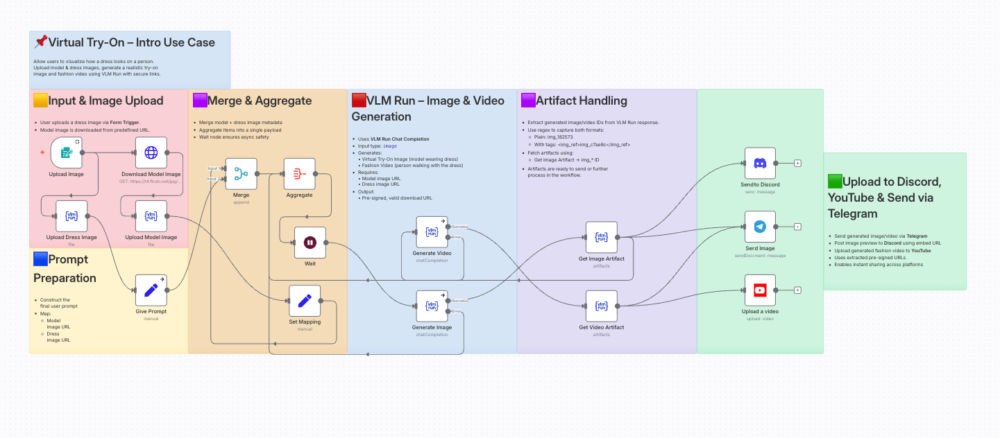

# AI Fashion Virtual Try-On with Image & Video Generation

Automate virtual try-on experiences using VLM Run's visual AI capabilities. This workflow allows users to visualize how a dress looks on a fashion model, generating realistic try-on images and fashion videos.

## 📸 Workflow Screenshot

## 🎯 Use Case

Perfect for virtual try-ons, AI fashion demos, or content automation pipelines. Users can upload a dress image and the workflow automatically:
- Generates a virtual try-on image (model wearing the dress)
- Creates a fashion video (person walking with the dress)
- Distributes content to Telegram, Discord, and YouTube

## 🔧 How It Works

1. **Input & Image Upload** – User uploads a dress image via Form Trigger. A model image is downloaded from a predefined URL.
2. **Merge & Aggregate** – Merges model and dress image metadata into a single payload.
3. **VLM Run Image & Video Generation** – Uses VLM Run Chat Completion to generate:
   - Virtual try-on image (model wearing dress)
   - Fashion video (model walking with the dress)
4. **Artifact Handling** – Extracts generated image/video IDs using regex and fetches artifacts via session ID.
5. **Multi-Platform Distribution** – Sends generated content to Telegram, Discord, and uploads video to YouTube.

## 📦 Required Integrations

| Integration | Purpose |
|-------------|---------|
| **VLM Run** | Visual AI for image/video generation |
| **Telegram** | Send generated images via bot |
| **Discord** | Post image previews to channels |
| **YouTube** | Upload fashion videos |

## 🔑 VLM Run Setup

This workflow uses VLM Run for Visual AI capabilities.

1. **Get API Key**: Sign up at [app.vlm.run](https://app.vlm.run/) and create an API key
2. **Configure in n8n**: Click any VLM Run node → Create New Credential → Enter API key
3. **Operations used**:
   - `File Upload` – Upload dress and model images
   - `Chat Completion` – Generate try-on images and fashion videos
   - `Artifacts` – Retrieve generated content

> 📚 [VLM Run Documentation](https://docs.vlm.run/)

## ⚙️ Setup Instructions

1. Import `workflow.json` into your n8n instance
2. Configure the following credentials:
   - VLM Run API key ([Get one here](https://app.vlm.run/))
   - Telegram Bot token and Chat ID
   - Discord OAuth2
   - YouTube OAuth2
3. Update the model image URL if needed
4. Test the workflow using the Form Trigger

## 📂 Files

- `workflow.json` – The n8n workflow definition
- `README.md` – This documentation
- `screenshot.png` – Visual representation of the workflow
