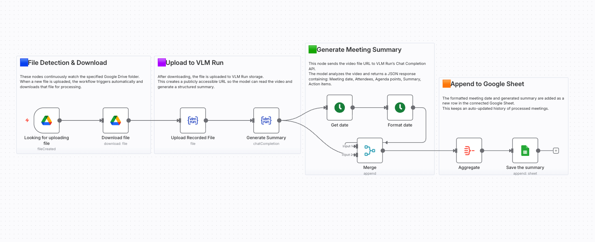

# Auto Meeting Summarizer with Google Drive, VLM Run to Sheets

Automatically summarize meeting recordings from Google Drive using VLM Run's visual AI and save structured summaries to Google Sheets.

## 📸 Workflow Screenshot



## 🎯 Use Case

Streamline meeting documentation by automatically processing uploaded meeting recordings. The workflow:
- Watches a Google Drive folder for new video uploads
- Generates structured meeting summaries with attendees, agenda, and action items
- Saves summaries to a Google Sheet for easy tracking

## 🔧 How It Works

1. **File Detection & Download** – Google Drive Trigger watches a specified folder. When a new file is uploaded, it automatically downloads the recording.
2. **Upload to VLM Run** – The downloaded video is uploaded to VLM Run storage, creating a publicly accessible URL for processing.
3. **Generate Meeting Summary** – VLM Run Chat Completion analyzes the video and returns structured JSON containing:
   - Meeting date
   - Attendees list
   - Agenda points
   - Detailed summary
   - Action items with assignees and due dates
4. **Append to Google Sheet** – The formatted meeting date and summary are added as a new row in the connected Google Sheet.

## 📦 Required Integrations

| Integration | Purpose |
|-------------|---------|
| **VLM Run** | Visual AI for video analysis |
| **Google Drive** | Watch folder and download recordings |
| **Google Sheets** | Store meeting summaries |

## 🔑 VLM Run Setup

This workflow uses VLM Run for Visual AI capabilities.

1. **Get API Key**: Sign up at [app.vlm.run](https://app.vlm.run/) and create an API key
2. **Configure in n8n**: Click any VLM Run node → Create New Credential → Enter API key
3. **Operations used**:
   - `File Upload` – Upload meeting recordings
   - `Chat Completion` – Analyze video and extract structured summary

> 📚 [VLM Run Documentation](https://docs.vlm.run/)

## ⚙️ Setup Instructions

1. Import `workflow.json` into your n8n instance
2. Configure the following credentials:
   - VLM Run API key ([Get one here](https://app.vlm.run/))
   - Google Drive OAuth2
   - Google Sheets OAuth2
3. Update the Google Drive folder ID to watch
4. Update the Google Sheet document ID and sheet name
5. Activate the workflow to start monitoring

## 📋 Output Schema

The workflow generates structured output with:

```json
{
  "meeting_date": "YYYY-MM-DD",
  "attendees": ["Person 1", "Person 2"],
  "agenda_points": ["Topic 1", "Topic 2"],
  "summary": "Detailed meeting summary...",
  "action_items": [
    {
      "task": "Description",
      "assigned_to": "Person",
      "due_date": "YYYY-MM-DD"
    }
  ]
}
```

## 📂 Files

- `workflow.json` – The n8n workflow definition
- `README.md` – This documentation
- `screenshot.png` – Visual representation of the workflow
