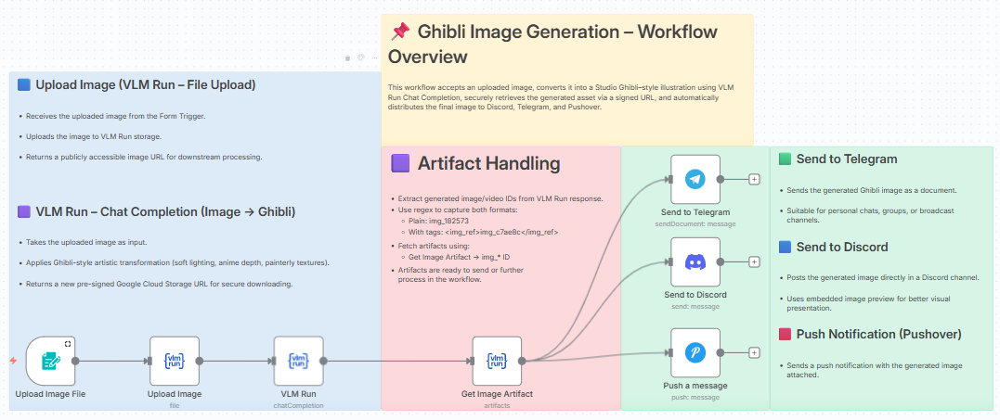

# Image to Ghibli Art Using VLM Run with Discord, Telegram, Pushover

Transform any uploaded image into a beautiful Studio Ghibli-style illustration using VLM Run's visual AI and automatically distribute to multiple platforms.

## 📸 Workflow Screenshot

## 🎯 Use Case

This workflow accepts an uploaded image, converts it into a Studio Ghibli-style illustration with:
- Soft lighting
- Anime depth
- Painterly textures

The generated artwork is then automatically distributed to Discord, Telegram, and Pushover.

## 🔧 How It Works

1. **Upload Image** – User uploads an image via Form Trigger.
2. **VLM Run File Upload** – Receives the uploaded image and uploads it to VLM Run storage, returning a publicly accessible URL.
3. **VLM Run Chat Completion** – Applies Ghibli-style artistic transformation to the image and returns a new pre-signed Google Cloud Storage URL.
4. **Artifact Handling** – Extracts the generated image ID using regex and fetches the artifact securely.
5. **Multi-Platform Distribution**:
   - **Telegram** – Sends as document suitable for personal chats, groups, or broadcast channels
   - **Discord** – Posts with embedded image preview for better visual presentation
   - **Pushover** – Sends push notification with image attached

## 📦 Required Integrations

| Integration | Purpose |
|-------------|---------|
| **VLM Run** | Visual AI for Ghibli-style transformation |
| **Telegram** | Send generated images via bot |
| **Discord** | Post image previews to channels |
| **Pushover** | Push notifications with images |

## 🔑 VLM Run Setup

This workflow uses VLM Run for Visual AI capabilities.

1. **Get API Key**: Sign up at [app.vlm.run](https://app.vlm.run/) and create an API key
2. **Configure in n8n**: Click any VLM Run node → Create New Credential → Enter API key
3. **Operations used**:
   - `File Upload` – Upload images for transformation
   - `Chat Completion` – Apply Ghibli-style artistic transformation
   - `Artifacts` – Retrieve generated artwork

> 📚 [VLM Run Documentation](https://docs.vlm.run/)

## ⚙️ Setup Instructions

1. Import `workflow.json` into your n8n instance
2. Configure the following credentials:
   - VLM Run API key ([Get one here](https://app.vlm.run/))
   - Telegram Bot token and Chat ID
   - Discord OAuth2
   - Pushover API credentials
3. Test the workflow using the Form Trigger URL

## 🎨 Art Style Features

The Ghibli transformation includes:
- Soft, dreamy lighting
- Signature anime depth and atmosphere
- Painterly watercolor textures
- Nostalgic Studio Ghibli aesthetic

## 📂 Files

- `workflow.json` – The n8n workflow definition
- `README.md` – This documentation
- `screenshot.png` – Visual representation of the workflow
