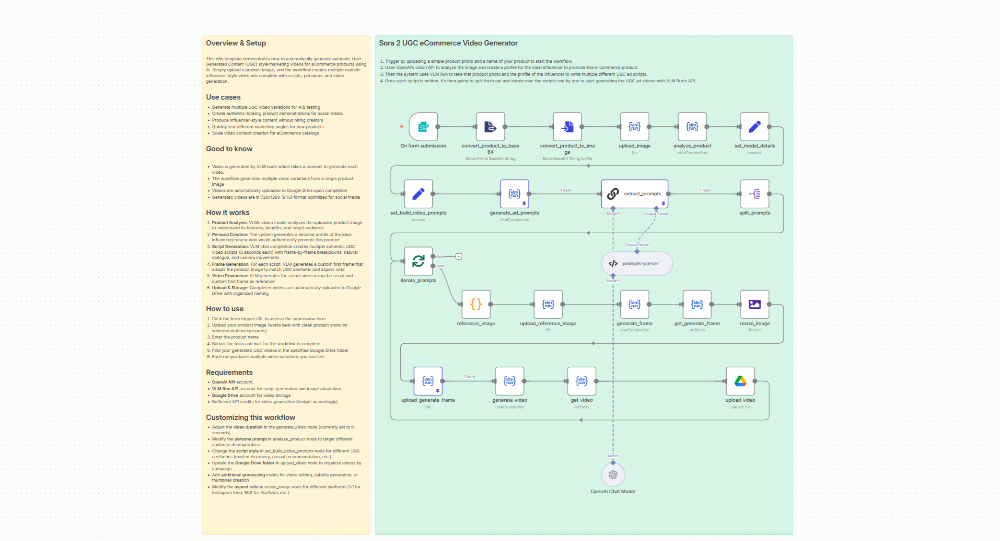

# Generate UGC Marketing Videos for eCommerce with VLM Run & OpenAI

Automatically generate authentic User-Generated Content (UGC) style marketing videos for eCommerce products using AI. Simply upload a product image, and the workflow creates multiple realistic influencer-style video ads.

## 📸 Workflow Screenshot

## 🎯 Use Cases

- Generate multiple UGC video variations for A/B testing
- Create authentic-looking product demonstrations for social media
- Produce influencer-style content without hiring creators
- Quickly test different marketing angles for new products
- Scale video content creation for eCommerce catalogs

## 🔧 How It Works

1. **Product Analysis** – VLM Run's vision model analyzes the uploaded product image to understand its features, benefits, and target audience.
2. **Persona Creation** – The system generates a detailed profile of the ideal influencer/creator who would authentically promote this product.
3. **Script Generation** – VLM Run creates multiple authentic UGC video scripts (12 seconds each) with:
   - Frame-by-frame breakdowns
   - Natural dialogue
   - Camera movements
   - Authentic speech patterns
4. **Frame Generation** – For each script, VLM Run generates a custom first frame that adapts the product image to match UGC aesthetic and 9:16 aspect ratio.
5. **Video Production** – VLM Run generates the actual video using the script and custom first frame as reference.
6. **Upload & Storage** – Completed videos are automatically uploaded to Google Drive with organized naming.

## 📦 Required Integrations

| Integration | Purpose |
|-------------|---------|
| **VLM Run** | Visual AI for analysis, script generation, and video creation |
| **OpenAI** | Prompt extraction and parsing |
| **Google Drive** | Store generated videos |

## 🔑 VLM Run Setup

This workflow uses VLM Run for Visual AI capabilities.

1. **Get API Key**: Sign up at [app.vlm.run](https://app.vlm.run/) and create an API key
2. **Configure in n8n**: Click any VLM Run node → Create New Credential → Enter API key
3. **Operations used**:
   - `File Upload` – Upload product images and generated frames
   - `Chat Completion` – Analyze products, generate scripts, create frames and videos
   - `Artifacts` – Retrieve generated images and videos

> 📚 [VLM Run Documentation](https://docs.vlm.run/)

## ⚙️ Setup Instructions

1. Import `workflow.json` into your n8n instance
2. Configure the following credentials:
   - VLM Run API key ([Get one here](https://app.vlm.run/))
   - OpenAI API key
   - Google Drive OAuth2
3. Update the Google Drive folder URL for video storage
4. Access the form trigger URL to submit products

## 🎬 Video Specifications

- **Duration:** 12 seconds
- **Aspect Ratio:** 9:16 (720x1280)
- **Style:** Raw, authentic iPhone aesthetic
- **Variations:** Multiple scripts per product (Excited Discovery, Casual Recommendation, In-the-Moment Demo)

## 📝 Script Styles Generated

1. **Excited Discovery** – Just found it, have to share
2. **Casual Recommendation** – Talking to camera like a friend
3. **In-the-Moment Demo** – Showing while using it

## 📂 Files

- `workflow.json` – The n8n workflow definition
- `README.md` – This documentation
- `screenshot.png` – Visual representation of the workflow
