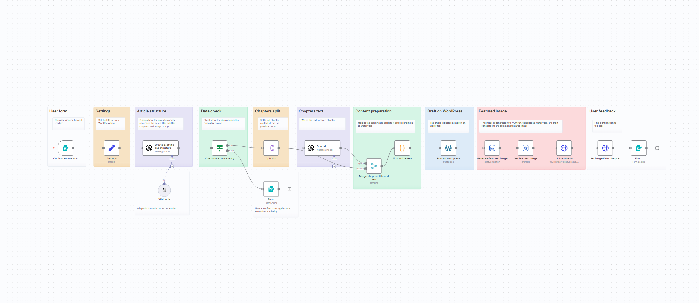

# Write a WordPress Post with AI (Starting from a Few Keywords)

Automatically generate complete, SEO-friendly WordPress blog posts from just a few keywords using OpenAI and VLM Run for content and featured image generation.

## 📸 Workflow Screenshot

## 🎯 Use Case

Transform a simple list of keywords into a fully structured blog post with:

- AI-generated title and subtitle
- Multiple chapters with coherent content
- Introduction and conclusions
- Photographic featured image
- Automatic WordPress draft creation

## 🔧 How It Works

1. **User Form** – User triggers the workflow with keywords, number of chapters, and max word count.
2. **Article Structure** – OpenAI generates title, subtitle, chapters, introduction, conclusions, and an image prompt using Wikipedia for fact-checking.
3. **Data Check** – Validates that all required data is present before proceeding.
4. **Chapters Split** – Splits chapter details for individual processing.
5. **Chapters Text** – OpenAI writes the text for each chapter, considering previous and following chapters for coherence.
6. **Content Preparation** – Merges all content and prepares it for WordPress.
7. **Draft on WordPress** – Posts the article as a draft on WordPress.
8. **Featured Image** – VLM Run generates a photographic cover image based on the article's image prompt.
9. **Image Upload** – Uploads the image to WordPress and sets it as the featured image.
10. **User Feedback** – Confirms successful creation to the user.

## 📦 Required Integrations

| Integration   | Purpose                                         |
| ------------- | ----------------------------------------------- |
| **VLM Run**   | Featured image generation                       |
| **OpenAI**    | Content generation (title, structure, chapters) |
| **WordPress** | Post creation and media upload                  |
| **Wikipedia** | Fact-checking and information gathering         |

## 🔑 VLM Run Setup

This workflow uses VLM Run for Visual AI capabilities.

1. **Get API Key**: Sign up at [app.vlm.run](https://app.vlm.run/) and create an API key
2. **Configure in n8n**: Click any VLM Run node → Create New Credential → Enter API key
3. **Operations used**:
   - `Chat Completion` – Generate photographic featured image
   - `Artifacts` – Retrieve generated image

> 📚 [VLM Run Documentation](https://docs.vlm.run/)

## ⚙️ Setup Instructions

1. Import `workflow.json` into your n8n instance
2. Configure the following credentials:
   - VLM Run API key ([Get one here](https://app.vlm.run/))
   - OpenAI API key
   - WordPress API credentials
3. Update the `wordpress_url` in the Settings node
4. Access the form trigger URL to create posts

## 📝 Form Inputs

| Field              | Description                            |
| ------------------ | -------------------------------------- |
| Keywords           | Comma-separated topics for the article |
| Number of chapters | 1-10 chapters                          |
| Max words count    | Target word count for the article      |

## 📋 Output Features

- SEO-friendly title and subtitle
- Coherent multi-chapter structure
- HTML-formatted content (bold, italic, lists)
- Introduction and conclusions
- Photographic featured image
- Draft status for review before publishing

## 📂 Files

- `workflow.json` – The n8n workflow definition
- `README.md` – This documentation
- `screenshot.png` – Visual representation of the workflow
